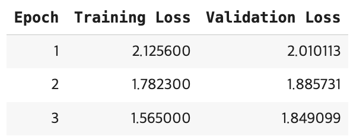
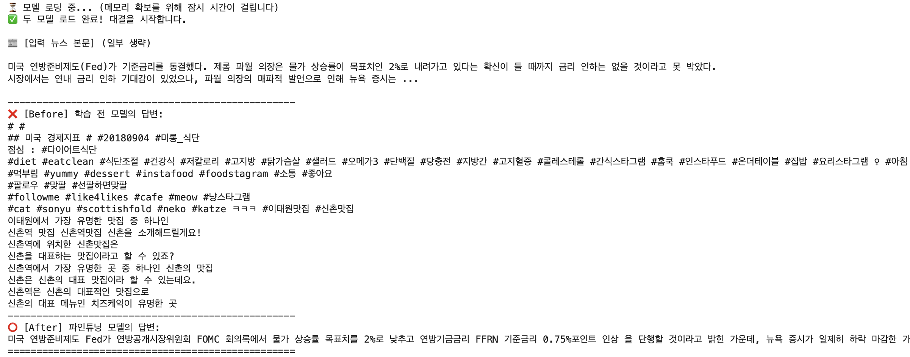

# 📈 Economy News Summarizer (KoGPT2 Fine-tuning)

> **"복잡한 경제 뉴스, 핵심만 3줄로 요약합니다."** > SKT KoGPT2 모델을 경제 뉴스 데이터로 파인튜닝(Fine-tuning)하여 도메인 특화 요약 모델을 구축한 프로젝트입니다.

## 📌 Project Overview

OpenAI의 GPT-2는 기존 모델들과 달리 Zero-shot 수행이 가능하고, Layer Norm의 위치를 조정하여 깊은 레이어에서도 학습이 안정적으로 이루어지도록 설계되었습니다.

본 프로젝트는 한국어 성능이 검증된 **`skt/kogpt2-base-v2`** 모델을 기반으로, 긴 경제 뉴스 기사를 입력받아 핵심 내용을 3줄 요약으로 생성하는 **Summarization Model**을 만드는 것을 목표로 합니다. 단순히 다음 단어를 예측하는 것을 넘어, **Instruction Tuning**을 통해 요약 Task를 수행하도록 학습시켰습니다.

---

## 🆚 Performance Comparison (Before vs After)

Fine-tuning 전후의 성능 차이를 확인하기 위해, 동일한 **'미 연준(Fed) 금리 동결'** 뉴스를 입력하여 테스트했습니다.

*(위 이미지는 학습 전/후 모델의 실제 추론 결과 비교입니다)*

| 구분 | 모델 (Model) | 결과 분석 (Analysis) |
| :--- | :--- | :--- |
| **❌ Before** | `Original KoGPT2` | **요약 실패.** 뉴스 내용과 무관한 다이어트, 맛집 해시태그 등을 무작위로 생성하며 횡설수설함 (Hallucination & Repetition). |
| **⭕ After** | `Fine-tuned Model` | **요약 성공.** "물가 상승률 목표치 2%", "연방기금금리 인상", "뉴욕 증시 하락" 등 핵심 키워드를 포착하여 완벽한 문장으로 요약함. |

---

## 📊 Dataset & Preprocessing

* **Dataset:** `daekeun-ml/naver-news-summarization-ko`
* **Filtering:** 전체 데이터 중 **'경제(economy)'** 카테고리 뉴스 10,000건 추출
* **Prompt Engineering:** 모델이 뉴스 본문과 요약을 구분할 수 있도록 Special Token을 활용해 프롬프트를 구성했습니다.