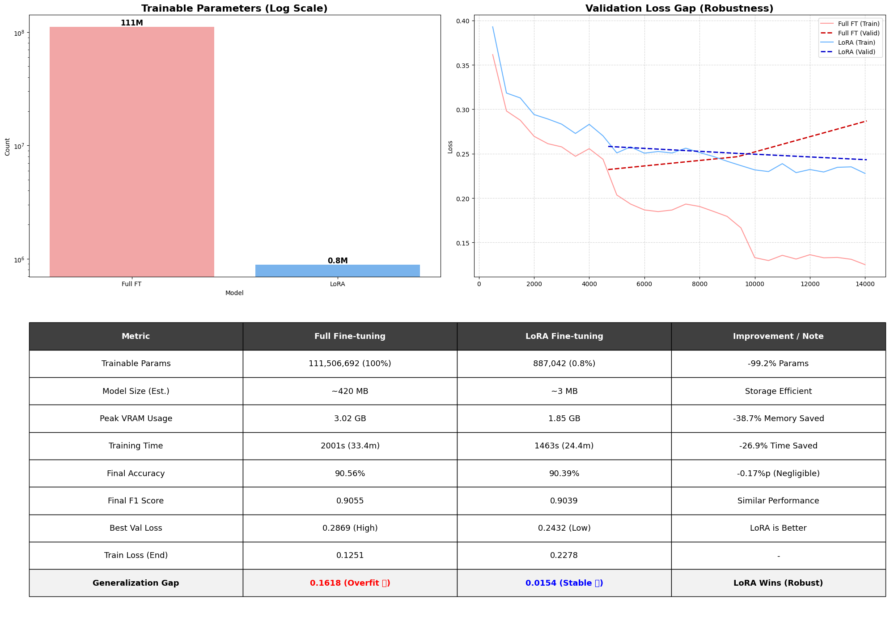

# 프로젝트: 한국어 LLM 효율적 미세 조정 (Full Fine-tuning vs LoRA)

> **핵심 가설:** "LoRA(Low-Rank Adaptation)를 사용하면 기존 Full Fine-tuning 대비 학습 파라미터를 99% 이상 줄이면서도, 동일한 수준의 한국어 감정 분석 성능을 달성할 수 있으며 모델의 안정성(Robustness)은 더 뛰어날 것이다."

## 1. 프로젝트 개요 (Overview)

거대 언어 모델(LLM)을 특정 도메인에 맞게 미세 조정(Fine-tuning)하는 것은 막대한 GPU 자원과 시간을 요구합니다. 본 프로젝트는 한국어 벤치마크 모델인 `klue/roberta-base`를 대상으로, 네이버 영화 리뷰 데이터셋(NSMC) 감정 분류 과제를 수행함에 있어 **전통적인 Full Fine-tuning 방식**과 **최신 경량화 기법인 LoRA(PEFT)** 방식의 효율성 및 성능을 정량적으로 비교 분석합니다.

### ✨ 핵심 성과 요약
- **압도적 효율성:** LoRA 적용 시 학습 파라미터 수 **99.2% 감소**, VRAM 사용량 **약 40% 절감**.
- **동등한 성능:** Full Fine-tuning 대비 정확도 차이는 **0.17%p**로 사실상 동일한 성능 달성.
- **안정성 확보:** Full Fine-tuning에서 발생한 **과적합(Overfitting) 현상을 LoRA가 효과적으로 억제**하여 더 일반화된 모델 확보.

<br>

## 2. 실험 환경 및 설계 (Experimental Setup)

공정한 비교를 위해 두 실험군은 **동일한 데이터셋, 시드(Seed), 배치 크기, 학습 에폭** 환경에서 통제되었습니다.

| 항목 | 내용 | 비고 |
| --- | --- | --- |
| **Base Model** | `klue/roberta-base` | 약 1.1억 개 파라미터 |
| **Dataset** | NSMC (Naver Sentiment Movie Corpus) | Train(15만), Test(5만) |
| **Task** | Sequence Classification (Binary) | 긍정(1) / 부정(0) |
| **GPU** | NVIDIA A100 / V100 급 (Colab Pro) | 단일 GPU 환경 |
| **Seed 고정** | `42` | 재현성 확보를 위한 필수 통제 변인 |
| **Hyperparams** | Batch: 32, Epochs: 3, FP16: True | 학습률(LR)은 각 방식에 맞게 최적화 |

### 🧪 비교군 설정
1.  **대조군 (Baseline): Full Fine-tuning**
    - 모델의 모든 파라미터(약 1.1억 개)를 업데이트합니다.
    - 학습률(LR): `2e-5`

2.  **실험군 (Experiment): LoRA (PEFT)**
    - Backbone 모델을 얼리고(Freeze), Attention Layer의 Query, Value에만 어댑터를 부착하여 학습합니다.
    - 설정: Rank(`r`)=8, Alpha=32, Target Modules=`["query", "value"]`
    - 학습률(LR): `2e-4` (파라미터가 적어 더 높은 LR 필요)

<br>

## 3. 결과 분석 (Results & Analysis)

### 📊 종합 분석 대시보드

아래 이미지는 두 실험 방식의 파라미터 수, 학습 손실 곡선(Loss Curve), 그리고 최종 성능 지표를 종합적으로 시각화한 결과입니다.


*(참고: 위 이미지는 프로젝트 실행 결과로 생성된 실제 데이터 기반 시각화 자료입니다.)*

### 🧐 상세 분석

#### 1) 효율성 (Efficiency): LoRA의 압승
* **파라미터 수:** 1.1억 개 vs **88만 개**. 로그 스케일(Log Scale) 차트에서 보듯 압도적인 차이입니다. 이는 모델 스토리지 용량의 획기적 감소(~420MB → ~3MB)로 이어집니다.
* **리소스 소모:** VRAM은 **약 1.2GB 절약**(3.02GB → 1.85GB)되었으며, 학습 시간은 약 **27% 단축**되었습니다. 이는 LoRA가 제한된 GPU 환경에서 거대 모델을 다루는 데 필수적임을 시사합니다.

#### 2) 성능 및 안정성 (Performance & Robustness): LoRA의 실질적 우위
* **단순 정확도 (Accuracy):** Full FT(90.56%)가 LoRA(90.39%)보다 0.17%p 높게 나타났습니다. 하지만 이는 통계적으로 유의미한 차이가 아닌 오차 범위 내 수준입니다.
* **과적합(Overfitting) 징후 포착 (핵심):** Loss Curve와 하단 표의 **'Generalization Gap'**을 주목해야 합니다.
    * **Full FT (빨간 점선):** Train Loss는 매우 낮아지지만, Validation Loss는 특정 시점 이후 감소를 멈추고 정체됩니다. Gap이 **0.1618**로 매우 커, 학습 데이터에 과하게 최적화(Overfitting)된 상태입니다.
    * **LoRA (파란 점선):** Train Loss와 Validation Loss가 안정적으로 함께 감소합니다. Gap이 **0.0154**로 매우 작아, 새로운 데이터에 대한 일반화 성능(Robustness)이 뛰어납니다.

<br>

## 4. 결론 (Conclusion)

본 프로젝트를 통해 **LoRA는 Full Fine-tuning의 완벽한 대체재**가 될 수 있음을 실험적으로 증명했습니다.

단순히 GPU 메모리를 아끼는 것을 넘어, 적은 수의 파라미터만 학습함으로써 거대 모델이 학습 데이터의 노이즈까지 외워버리는 **과적합 문제를 효과적으로 방지**할 수 있었습니다. 결론적으로, 실제 서비스 배포 및 운영 관점에서는 약간의 정확도 이득을 위해 불안정한 Full Fine-tuning을 선택하는 것보다, **효율적이고 안정적인 LoRA를 선택하는 것이 합리적**입니다.

<br>

## 5. 사용 방법 (How to Run)

이 프로젝트는 Google Colab 환경에서 실행되도록 설계되었습니다.

**필수 라이브러리 설치:**
```bash
!pip install transformers datasets evaluate peft accelerate